# 侗茶和天下｜三江侗族打油茶数字文化体验平台

<p align="center">
  <b>一碗油茶，和合天下。</b><br>
  让三江侗族打油茶文化从“被看见”，走向“被理解、被参与、被记住”。
</p>

<p align="center">
  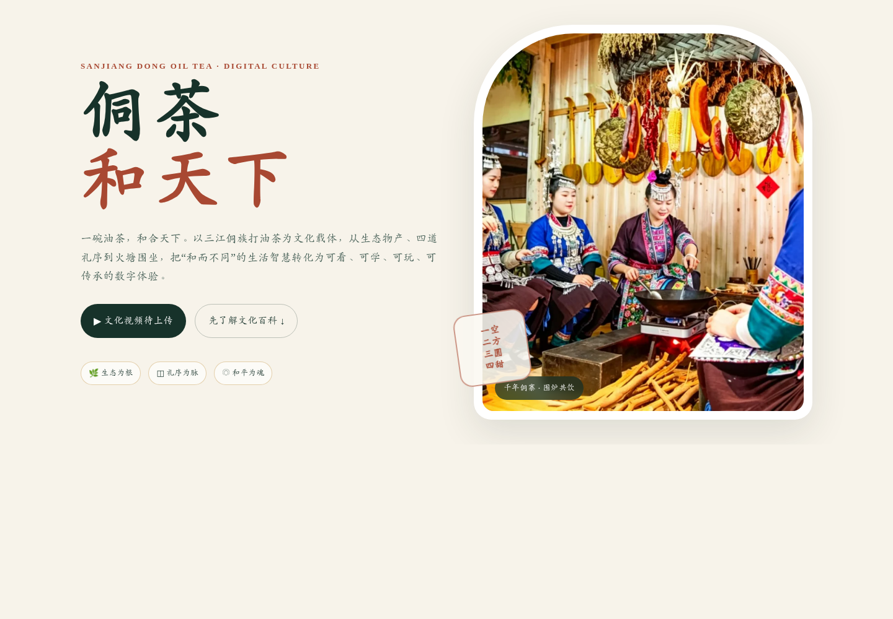
</p>

## 项目简介

**《侗茶和天下》** 是一个围绕三江侗族打油茶文化设计的数字文化体验网页。项目以三江油茶的生态物产、四道礼序、火塘围坐与“和而不同”的文化智慧为核心，将传统文化内容转化为可看、可学、可答、可做、可传、可悟的互动体验。

当前 GitHub 公开版采用 **单页响应式 H5**，无需安装 App，PC 与手机浏览器均可直接打开。为适合公开仓库部署，本版本不包含宣传视频，也不在前端保存任何在线模型 API Key；“侗侗茶娘”使用本地文化知识库进行基础问答。

> **体验主线：看懂文化 → 记住知识 → 动手选料 → 学习礼序 → 获得身份 → 回到文化感悟**

## 在线体验

GitHub Pages 发布后，可将下面地址替换为你的实际链接：

**https://<你的GitHub用户名>.github.io/dongtea/**

仓库首页文件为 `index.html`，GitHub Pages 可直接以其作为网站入口。

---

## 文化基座

三江侗族打油茶并不只是一种饮食方式，而是一套连接 **生态物产、待客礼序、社群关系与生活哲学** 的文化系统。

- **生态为根**：茶叶、茶油、糯米、饭豆、花生、虾米等地方物产连接山林、农田、河谷与侗寨生活。
- **礼序为脉**：“一空、二方、三圆、四甜”以及火塘、传碗、敬茶歌、一根筷子等礼俗，将人生观和待客之道写入一碗茶。
- **和平为魂**：围炉共饮强调分享与秩序；“二方”中猪红可根据饮食禁忌替换为白豆腐，但“方正”的祝福不变，体现“和而不同”。

### 一空 · 二方 · 三圆 · 四甜

| 四道油茶 | 文化寓意 | 体验重点 |
| --- | --- | --- |
| **一空** | 静心、原味 | 阴米、油果、花生，先清空味蕾，也静下心来 |
| **二方** | 方正、包容 | 猪红或白豆腐，食材可变，祝福不变 |
| **三圆** | 团圆、和合 | 多种配料圆融合一，寓意团团圆圆 |
| **四甜** | 甘来、祝福 | 水圆与老姜红糖，寓意苦尽甘来 |

---

## 核心数字体验

### 01｜文化百科与真实原料图鉴

文化百科将四道油茶、原料、火塘礼序和文化寓意拆解成可查、可学的知识内容，并通过真实原料图片建立地方文化辨识度。

<p align="center">
  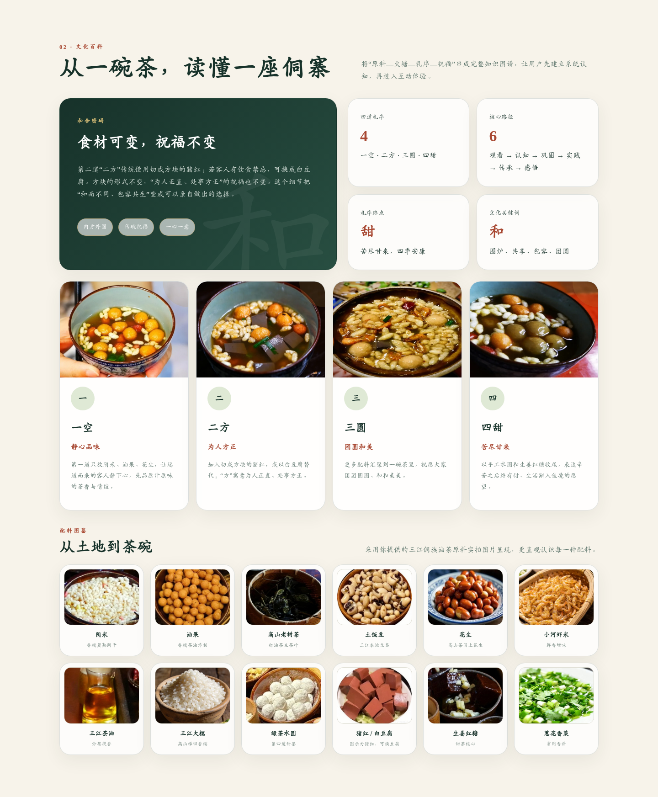
</p>

### 02｜文化问答

文化问答承担“重复记忆”的任务。用户完成图片选择题后获得即时反馈，答错不仅显示结果，还会给出相应文化解释，让“我看过了”进一步转化为“我记住了”。

<p align="center">
  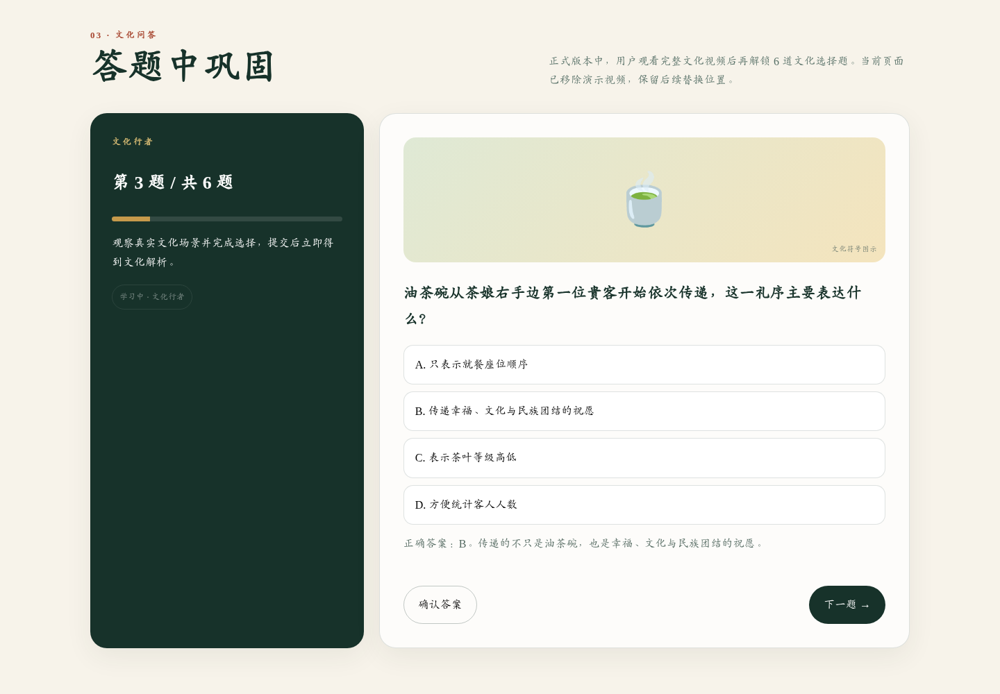
</p>

### 03｜云打茶体验馆

四个关卡分别对应“一空、二方、三圆、四甜”。用户通过选择原料亲手完成一碗油茶，把抽象知识转成具体操作。

其中“二方”支持 **猪红 / 白豆腐** 两种选择：食材可以因饮食习惯而变化，但“方正”的文化寓意保持不变。

<p align="center">
  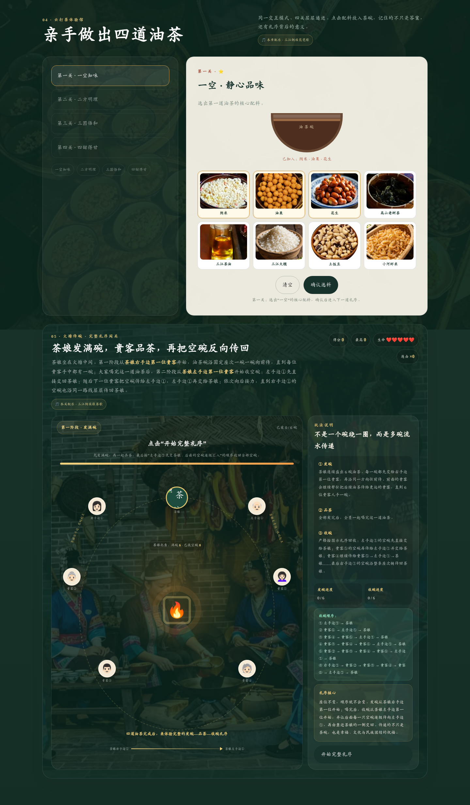
</p>

### 04｜火塘传碗礼序闯关

这是项目最核心的文化游戏化模块。玩法不是额外虚构一个小游戏，而是把真实的 **发碗 → 全员品茶 → 收碗** 礼序转化为可操作规则。

- **发碗**：茶娘从自己右手边第一位贵客开始，逐碗依次传出。
- **品茶**：所有贵客均拿到茶碗后，再进入共同品茶阶段。
- **收碗**：从茶娘左手边第一位贵客开始，后续空碗按照座次逐级汇入，最终回到茶娘手中。
- **游戏机制**：生命值、连击、计时、座次判断、积分与通关反馈共同强化礼序记忆。

<p align="center">
  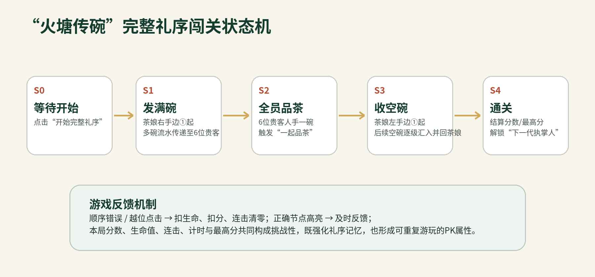
</p>

<p align="center">
  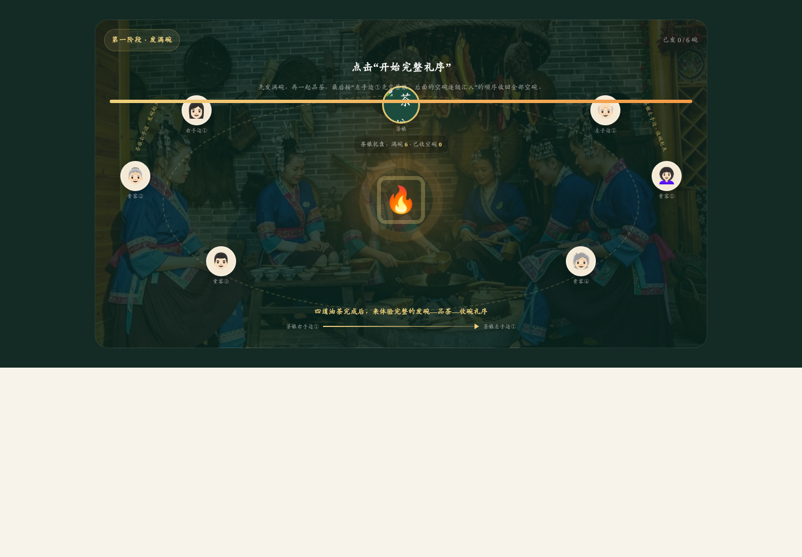
</p>

#### 收碗路径校准

收碗并不是简单“反向走一圈”，而是空碗从茶娘左手边开始，沿座次逐级汇回茶娘，从而保证下一道茶仍能各归其位、礼序有始有终。

<p align="center">
  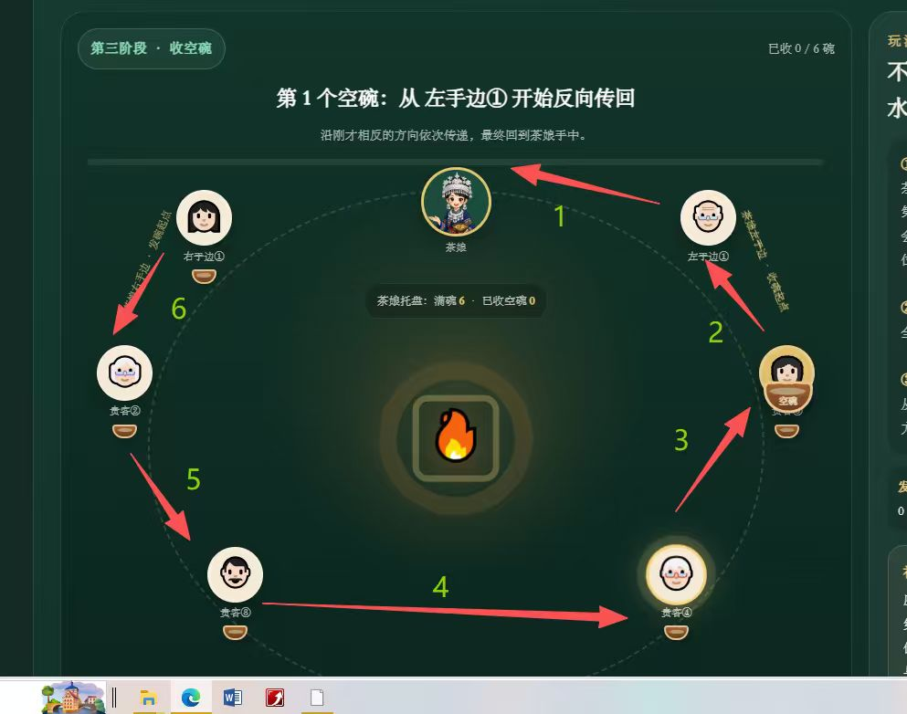
</p>

### 05｜通关仪式与和平茶叙

完成互动后，用户从“参观者”转变为 **“火炉塘下一代执掌人”**。最后的“和平茶叙”不再继续设置任务，而是通过文化故事卡片重新理解前面经历过的火塘、茶碗、筷子、四道油茶与“和而不同”。

<p align="center">
  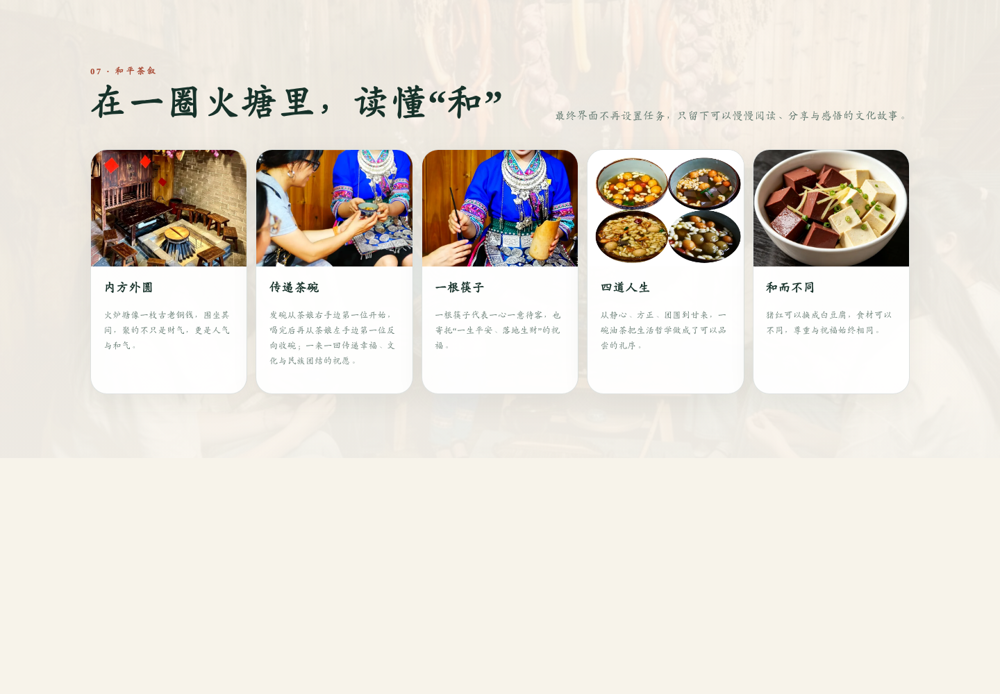
</p>

### 06｜侗侗茶娘

“侗侗茶娘”是项目中的文化问答角色。GitHub 公开版使用 **本地文化知识库**，可回答“一空二方三圆四甜”“火塘”“传碗”“一根筷子”“猪红换豆腐”等核心问题，同时避免在公开前端暴露 API Key。

<p align="center">
  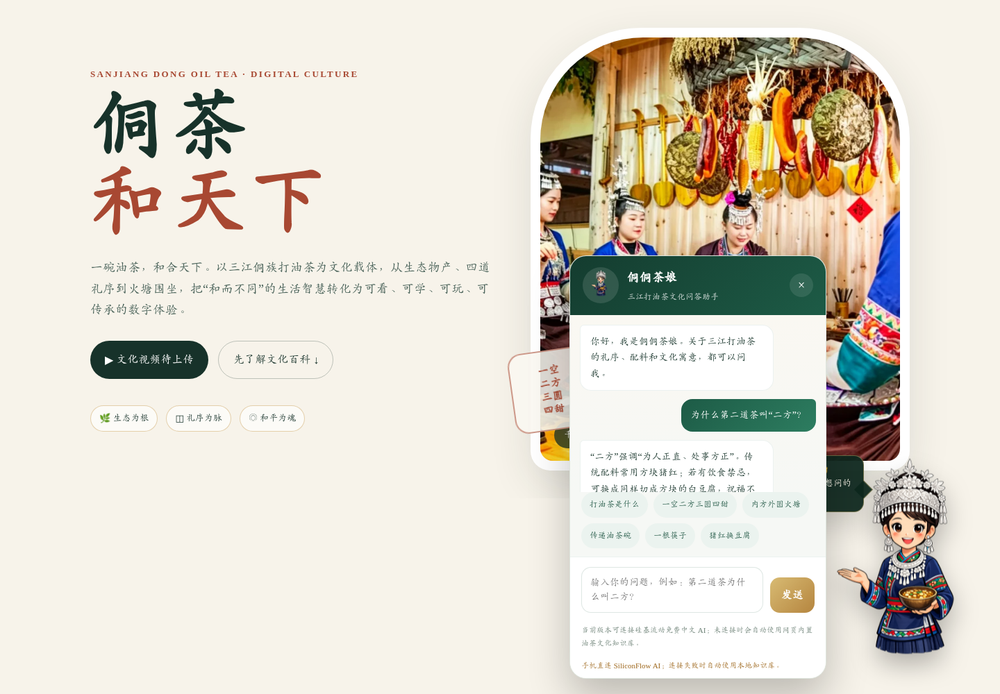
</p>

---

## 技术实现

当前公开版以轻量、稳定和低门槛传播为目标：

- **HTML5 / CSS3 / JavaScript**：单页前端实现主要内容与交互。
- **Responsive Web Design**：适配 PC 与手机竖屏浏览。
- **localStorage**：保存部分积分、成就与体验进度。
- **HTML5 Audio**：嵌入侗族敬茶歌、琵琶歌等民族音乐资源。
- **状态机交互**：用于文化问答、云打茶和火塘传碗的流程控制。
- **本地文化知识库**：公开部署版的数字茶娘无需在线 API Key。
- **单文件网站入口**：正式页面资源已内嵌于 `index.html`，便于 GitHub Pages、课堂演示和比赛展示。

<p align="center">
  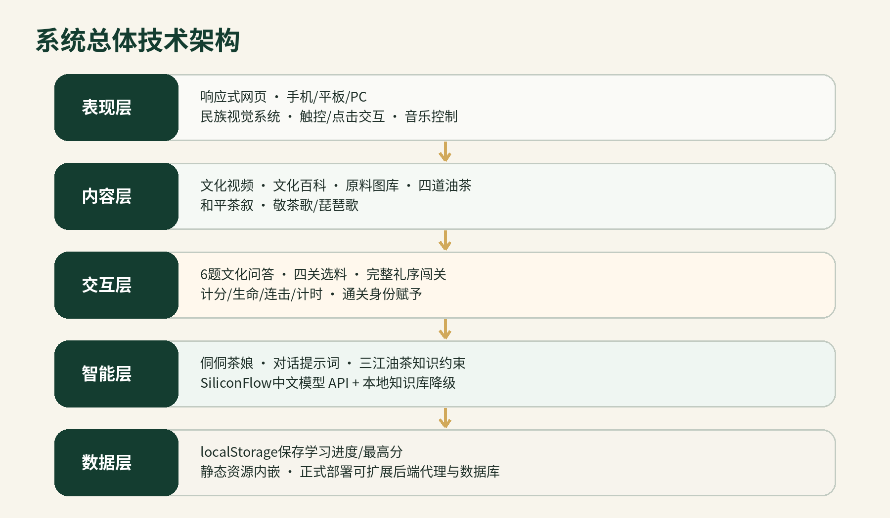
</p>

---

## 移动端适配

项目坚持“手机优先、PC兼容”。在手机浏览器中，文化百科、问答、云打茶、传碗闯关与数字茶娘均可使用触控完成。

<p align="center">
  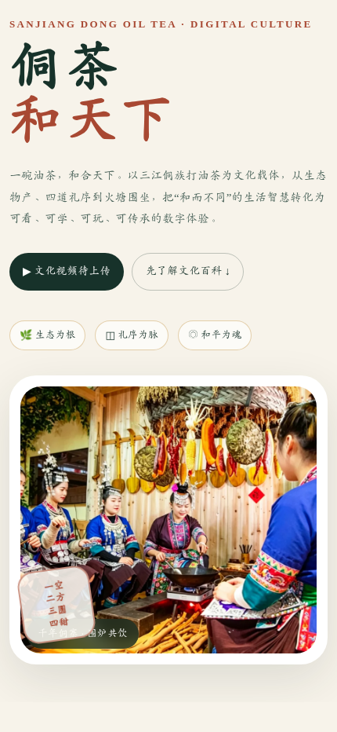
  &nbsp;&nbsp;&nbsp;&nbsp;
  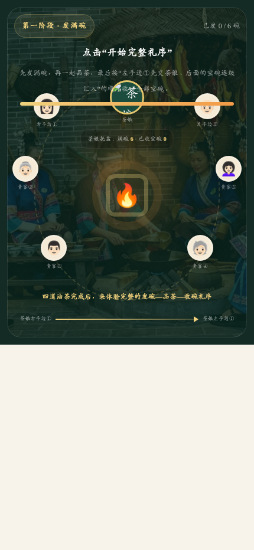
</p>

---

## 项目创新

### 1. 文化建模创新

不是把非遗内容简单“搬到网页”，而是从真实文化中提炼可数字化的结构：四道油茶形成知识主线，发碗—品茶—收碗形成礼序状态机，“食材可换、祝福不变”形成包容性交互规则。

### 2. 交互学习创新

将传统“看介绍”的传播方式重构为：

**百科学习 → 文化问答 → 云打茶选料 → 火塘传碗 → 身份通关 → 和平茶叙**

让用户从“知道”进一步走向“会选择、会操作、会解释”。

### 3. 数字传播创新

响应式 H5 无需安装，适合比赛展示、景区扫码、校园研学、非遗课堂和社交分享；本地知识库让公开部署版在不暴露密钥的情况下仍保留文化问答能力。

---

## 项目文件结构

```text
dongtea/
├── index.html          # 《侗茶和天下》正式网页，页面资源已内嵌
├── README.md           # GitHub 项目介绍
└── assets/             # README 展示图片，不影响网页运行
    ├── home.png
    ├── culture-encyclopedia.png
    ├── culture-quiz.png
    ├── game-overview.png
    ├── ritual-state-machine.png
    ├── ritual-game.png
    ├── bowl-return-path.jpg
    ├── peace-tea.png
    ├── tea-lady.png
    ├── architecture.png
    ├── mobile-home.png
    └── mobile-ritual.png
```

> `assets/` 中的图片主要用于 GitHub README 项目展示。网页本身仍由单个 `index.html` 独立运行。

---

## GitHub Pages 部署

1. 将 `index.html`、`README.md` 和 `assets/` 上传到仓库根目录。
2. 进入仓库 **Settings → Pages**。
3. `Source` 选择 **Deploy from a branch**。
4. `Branch` 选择 **main**，目录选择 **/(root)**。
5. 保存后即可获得 GitHub Pages 在线地址。

示例：

```text
https://<你的GitHub用户名>.github.io/dongtea/
```

---

## 应用场景

- **比赛展示**：评委通过网页链接直接体验完整作品。
- **景区扫码**：在侗寨、风雨桥、非遗馆等场景设置二维码入口。
- **校园研学**：作为民族文化、非遗保护、数字媒体课程的互动案例。
- **线下工坊**：形成“线上学习 → 游戏预习 → 线下打油茶”的组合体验。
- **文化传播**：通过手机端分享，让更多用户从“听说过”走向“玩过、理解过、记住过”。

---

## 项目愿景

> **一碗油茶，和合天下。**
>
> 我们希望让更多人不只是“听说过三江打油茶”，而是真正看懂它、玩过它、记住它，并愿意把这份文化继续传下去。

**团队：三江薪火**

